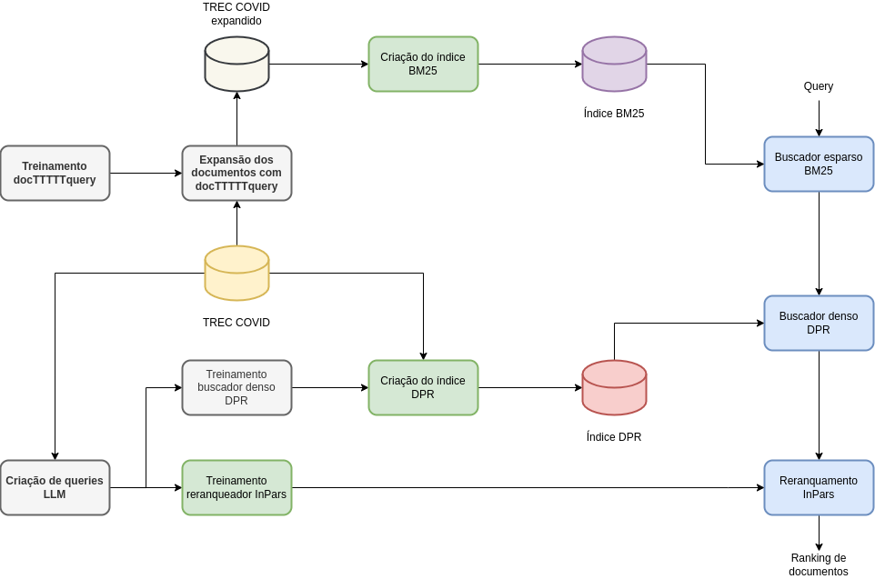
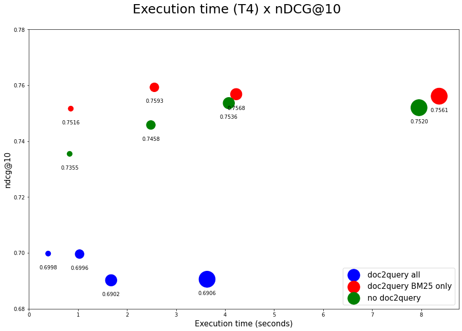

# ia368v_dd_class_10
Multi-stage IR pipeline

## Notebooks for this activity

* [multi_stage_pipeline.ipynb](multi_stage_pipeline.ipynb): Implements the multi-stage pipeline as depicted in the figure below:

  

* [results_compilation.ipynb](results_compilation.ipynb): Draws the simple chart depicting some of the test results on the TREC COVID queries.

## Final results

Unfortunately I was barely able to conclude the pipeline, having invested lots of time trying to use ColBERT instead of DPR, and also trying to further enhance the LLM synthetic queries to try improving the DPR and InPars reranking results, without any success. The chart below presents some of the results:

 

Check [here a presentation](https://docs.google.com/presentation/d/1hc6vSM48euDrVTDbA3s9cJ7b5YUHRaYPhYWM4vBG-3w/edit?usp=share_link) commenting this exercise resolution.

